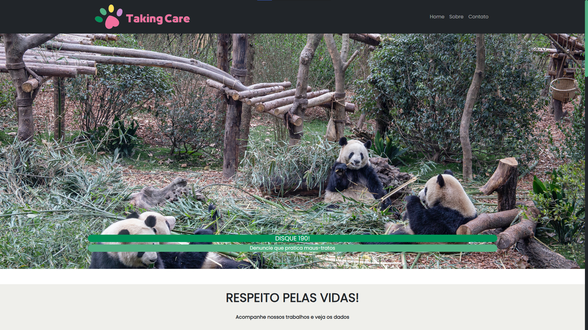

# ONG Taking Care

# 🐶🦴 

Após realizarmos o projeto qual cada aluno da sala de aula recebeu um tema específico para desenvolver seu próprio site, utilizando o React Bootstrap como ferramenta auxiliar. [(Loja de Ferramentas)](https://github.com/thiagobapsoares/AC-INW-2TRI) e o projeto sobre casos de feminicídio [(Página Institucional)] (https://github.com/thiagobapsoares/AC-PAGINA-INSTITUCIONAL)  
Agora estamos desenvolvendo outra página, porém, cada grupo poderia escolher um tema de uma ONG para seu site. O nosso foi Proteção Animal.

## 🐾 Funcionalidades

- Exibição de três diferentes páginas. (Home, Sobre e Contato);
- Utilização de Barra de Navegação, Carrossel de Imagens, Card's e Rodapé;
- Apresenta um layout simples e minimalista, com elementos visuais atrativos e de fácil leitura. A cor verde foi a escolhida para representar o site.

## 🦮 Orientações de Utilização

1. Faça o clone deste repositório em sua máquina;
2. Navegue até o diretório do projeto no terminal.
3. Execute o comando **npm install** para instalar as dependências necessárias;
4. Execute o comando **npm run dev** para abrir o projeto em seu navegador;

#### Este é um projeto escolar desenvolvido por Heloísa Real, Mateus Felipe Vieira e Thiago Baptista. Sinta-se à vontade para personalizar e aprimorar este projeto, adicionando diferentes recursos ou modificando o design para atender às suas necessidades. Não se esqueça de dar os créditos. 💚
